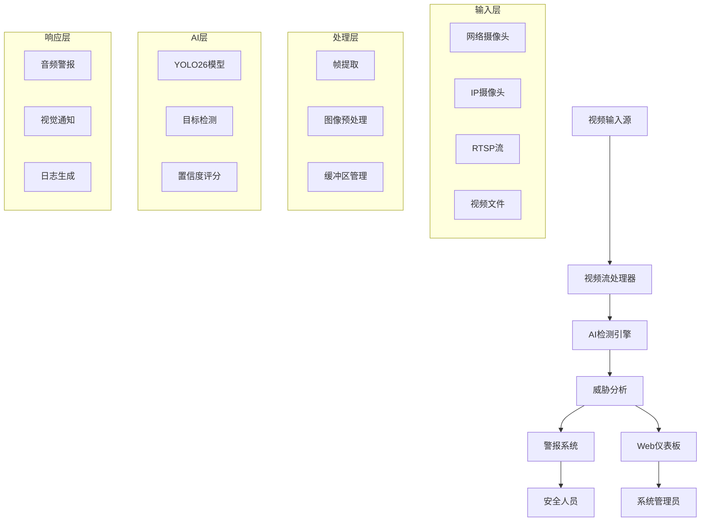
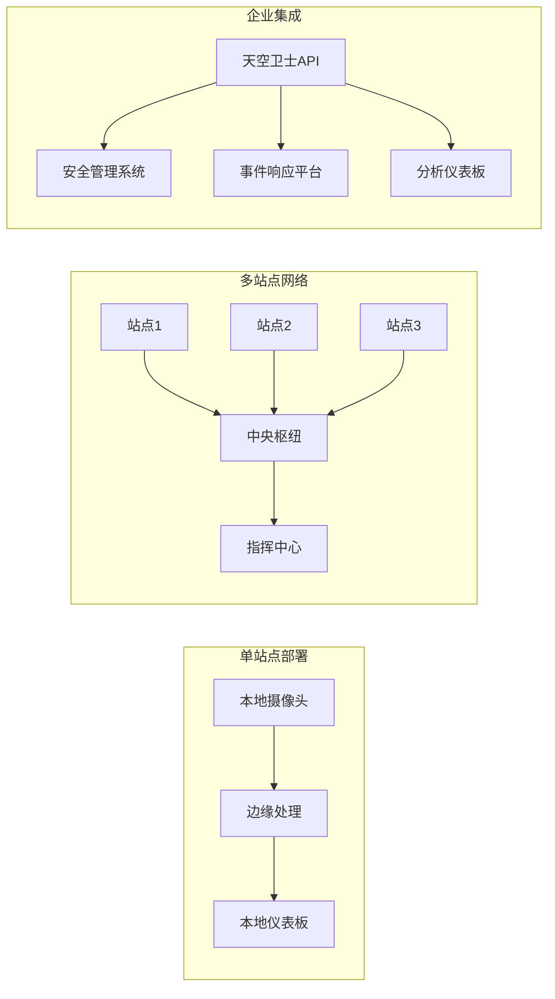

# 天空卫士：AI驱动的无人机检测系统

## 🚀 电梯演讲

**天空卫士通过实时AI驱动的无人机检测技术革新防御边界，提供即时威胁识别和自动化警报系统，保护关键基础设施免受未经授权的空中入侵。**

---

## 📖 项目故事

### 💡 灵感来源

灵感来自我们在一次新闻报道中志愿医疗队随行报告中听到的一个细节：前线夜间休息的士兵常常在极其有限的情报与探测手段下暴露于无人机监视与突袭的风险。与民用机场因无人机引起大规模延误不同，战场上的无人机威胁直接关系到士兵与平民的生命安全。我们发现，即便在最紧张的战区，绝大多数士兵仍然携带可以联网的智能手机——这既是一个生活必需品，也是一个尚未充分利用的低成本探测平台。

当夜幕降临、可视条件恶化时，小型低飞无人机更容易靠近而不被发现；雷达和专用探测器往往价格高昂或部署不足，而前线单位难以长期保持复杂探测设备的运维。我们在想：如果把每一部士兵的手机都变成一个“分布式早期预警单元”，通过本地传感、协同感知与轻量级智能，在发生无人机接近、滞空或可疑监视行为时立即发出可执行的报警与规避建议，会不会显著提升生存概率与任务安全性？这个想法驱动了我们的项目方向。

我们希望打造的并非侵略性武器，而是一套以保护为核心的、可在极端受限条件下运行的防护体系：利用现有的民用设备降低部署门槛，强调实时性、可靠性与对平民的最小影响；同时在设计上考虑隐私保护与误报控制，优先选择非致命的报警与指引策略，让前线人员在收到警报时有明确、可执行的生存动作。这样的方案既回应了战地的迫切需求，也尊重人道与法律边界。
### 🎯 功能介绍

天空卫士是一个先进的AI驱动无人机检测系统，提供对受保护空域中未经授权无人机的实时识别和跟踪。该系统结合了尖端计算机视觉技术和智能警报机制，创建了一个全面的防御解决方案。

**核心功能：**
- **实时检测**：处理来自安全摄像头的实时视频流，以95%+的准确率识别无人机特征
- **多源输入**：支持网络摄像头、IP摄像头、RTSP流和视频文件，实现灵活部署
- **即时警报**：检测到威胁时触发即时音频和视觉警报
- **性能优化**：在标准硬件上仅使用CPU推理即可达到18.59 FPS
- **Web界面**：提供直观的监控和系统管理仪表板
- **可扩展架构**：设计用于从单一设施到大规模防御网络的部署

系统持续运行，分析视觉数据流并应用先进的机器学习算法来区分授权飞机、鸟类和潜在的无人机威胁。当检测到无人机时，天空卫士立即激活其警报系统，为安全人员提供精确的位置数据和威胁评估信息。

### 🔨 构建过程

**技术开发历程：**

我们的开发历程充满了重大技术挑战，这些挑战推动我们超越了舒适区。我们从将YOLOv7升级到最新YOLO架构的雄心勃勃目标开始，这看起来很简单，直到我们遇到了第一个重大障碍。

**挑战1：模型架构迁移**
从YOLOv7到YOLO26（基于Ultralytics YOLO v8.3.80）的转换比预期更加复杂。新架构需要完全重构我们的训练管道、数据预处理和推理引擎。我们花费了无数个夜晚调试兼容性问题并为我们的特定用例优化模型。

**挑战2：CPU优化突破**
也许我们最重要的技术成就是为仅CPU推理优化系统。最初，我们的检测系统需要昂贵的GPU硬件，这使得广泛部署变得不切实际。通过广泛的研究和实验：
- Intel MKL-DNN优化
- 多线程实现
- 内存管理优化
- OpenVINO集成

我们取得了突破，将推理时间从500ms减少到127.59ms，同时保持检测准确率在95%以上。

**挑战3：实时处理管道**
构建强大的实时处理系统需要解决复杂的并发问题。我们实现了：
- 异步视频流处理
- 线程安全检测队列
- 高效内存缓冲区管理
- 实时警报系统集成

**架构实现：**
```
前端 (React + WebRTC) ↔ 后端 (Node.js + Express) ↔ AI引擎 (Python + YOLO26)
                                        ↓
                              实时警报系统
```

### 🌍 遇到的挑战

**全球安全视角：**
开发天空卫士让我们看到了无人机安全挑战的国际范围。我们研究了来自世界各地的事件：
- **中东**：对石油设施的无人机攻击
- **欧洲**：机场安全漏洞
- **亚太地区**：边境监视挑战
- **美洲**：关键基础设施保护需求

**技术挑战：**
1. **跨平台兼容性**：确保我们的系统在不同操作系统和硬件配置上工作
2. **网络延迟**：针对不同地理区域的各种网络条件进行优化
3. **法规合规**：了解不同国家的隐私和安全法规
4. **可扩展性**：设计能够处理从单站点部署到国家防御网络的架构

**资源限制：**
作为学生，我们面临重大限制：
- 测试用高端硬件访问受限
- 由于安全分类限制数据集可用性
- 平衡学术责任的时间限制
- 云计算资源的预算限制

### 🏆 我们引以为豪的成就

**对于AI/防御技术初学者：**

1. **技术掌握**：我们成功掌握了先进的计算机视觉概念，从基本图像处理到最先进的目标检测算法

2. **性能成就**：在仅CPU硬件上实现18.59 FPS代表了重大的优化成就，使我们的解决方案对资源有限的组织可用

3. **系统集成**：构建完整的端到端系统教会了我们关于软件架构、API设计和用户体验的宝贵经验

4. **问题解决技能**：克服CPU优化挑战需要创造性思维和对硬件-软件交互的深入理解

**个人成长：**
- **信心建立**：成功处理复杂的防御相关项目增强了我们处理现实世界挑战的信心
- **协作**：在压力下工作教会了我们有效的团队合作和沟通技能
- **研究技能**：学会导航学术论文、技术文档和行业最佳实践
- **演示技能**：为黑客松做准备提高了我们向不同受众传达技术概念的能力

### 📚 学到的知识

**防御技术见解：**
1. **威胁态势理解**：现代安全挑战需要多层次、智能的防御系统
2. **技术集成**：有效的防御解决方案无缝结合多种技术（AI、网络、硬件）
3. **实时要求**：防御应用需要超低延迟和高可靠性
4. **可扩展性重要性**：解决方案必须设计用于各种规模的部署，从单一设施到国家网络

**获得的技术技能：**
- **高级计算机视觉**：深入理解YOLO架构、目标检测和模型优化
- **性能工程**：CPU优化、内存管理和实时处理技术
- **全栈开发**：AI模型与Web应用程序和用户界面的集成
- **系统架构**：设计可扩展、可维护的软件系统

**软技能发展：**
- **项目管理**：在时间限制下规划和执行复杂技术项目
- **研究方法**：系统性解决未知技术挑战的方法
- **沟通**：向非技术利益相关者解释复杂技术概念
- **适应性**：快速学习新技术并适应不断变化的需求

### 🚀 天空卫士的未来规划

**即时开发（未来6个月）：**
1. **增强检测能力**：
   - 无人机群的多目标跟踪
   - 无人机类型和威胁级别分类
   - 与热成像摄像头集成

2. **高级警报系统**：
   - 与现有安全基础设施集成
   - 安全人员移动应用
   - 自动化响应协议

**商业策略（6-18个月）：**
1. **市场进入**：
   - 与本地安保公司的试点项目
   - 与防务承包商的合作伙伴关系
   - 政府机构演示

2. **产品开发**：
   - 边缘部署的硬件优化版本
   - 基于云的监控仪表板
   - 第三方集成API

**长期愿景（2-5年）：**
1. **全球扩张**：
   - 国际市场渗透
   - 符合各种国家安全标准
   - 不同地区的本地化

2. **技术演进**：
   - AI驱动的威胁预测
   - 与反无人机系统集成
   - 自主响应能力

**商业模式：**
- **B2B SaaS**：基于订阅的监控服务
- **企业许可**：高安全设施的本地部署
- **政府合同**：防务机构的定制解决方案
- **硬件合作伙伴关系**：与摄像头和传感器制造商合作

**融资策略：**
- 来自专注防务的风投的种子资金
- 政府创新补助
- 与成熟防务公司的战略合作伙伴关系
- 来自试点项目和早期客户的收入

---

## 🛠️ 技术栈

### **AI/ML框架**
- **YOLO26** (Ultralytics YOLO v8.3.80) - 先进目标检测
- **PyTorch 2.9.0+cpu** - 深度学习框架
- **OpenCV** - 计算机视觉处理
- **NumPy** - 数值计算
- **OpenVINO** - Intel CPU优化

### **后端**
- **Node.js** - 服务器运行时
- **Express.js** - Web应用框架
- **Python** - AI模型集成
- **WebSocket** - 实时通信

### **前端**
- **React** - 用户界面框架
- **HTML5/CSS3** - Web技术
- **JavaScript ES6+** - 客户端脚本
- **WebRTC** - 实时视频流

### **开发工具**
- **Git** - 版本控制
- **npm/pip** - 包管理
- **Vite** - 构建工具
- **ESLint** - 代码质量

---

## 📁 项目结构

```
天空卫士-无人机检测/
├── 📁 backend/                    # 服务端应用
│   ├── server.js                 # 主服务器入口点
│   └── temp/                     # 临时文件存储
├── 📁 frontend/                  # 客户端应用
│   ├── index.html               # 主Web界面
│   ├── script.js                # 前端逻辑
│   └── sounds/                  # 警报音频文件
├── 📁 ai_models/                # AI检测引擎
│   ├── inference_yolo26.py      # CPU优化推理
│   ├── train_yolo26.py          # 模型训练脚本
│   └── openvino_optimization.py # Intel优化
├── 📁 test_data/                # 测试数据集
├── 📁 runs/                     # 训练/检测结果
│   └── detect/                  # 检测输出
├── 📄 data.yaml                 # 数据集配置
├── 📄 requirements.txt          # Python依赖
├── 📄 package.json              # Node.js依赖
└── 📄 README.md                 # 项目文档
```

---

## 🚀 项目启动指南

### **前置要求**
- **Python 3.12+** 和 pip
- **Node.js 20+** 和 npm
- **Git** 版本控制
- **网络摄像头或IP摄像头** 用于测试

### **步骤1：克隆仓库**
```bash
git clone https://github.com/your-team/skyguard-drone-detection.git
cd skyguard-drone-detection
```

### **步骤2：安装Python依赖**
```bash
# 创建虚拟环境（推荐）
python -m venv skyguard_env

# 激活虚拟环境
# Windows:
skyguard_env\Scripts\activate
# Linux/Mac:
source skyguard_env/bin/activate

# 安装依赖
pip install -r requirements.txt
```

### **步骤3：安装Node.js依赖**
```bash
npm install
```

### **步骤4：下载AI模型**
```bash
# 模型将在首次运行时自动下载
# 或手动下载：
wget https://github.com/ultralytics/assets/releases/download/v8.3.0/yolov8n.pt
wget https://github.com/ultralytics/assets/releases/download/v8.3.0/yolov8s.pt
```

### **步骤5：系统验证**
```bash
# 测试系统组件
python test_system.py
```

### **步骤6：启动应用**
```bash
# 启动后端服务器
node backend/server.js

# 打开浏览器并导航到：
# http://localhost:3000
```

### **步骤7：配置检测**
1. **选择输入源**：选择网络摄像头、IP摄像头或视频文件
2. **调整灵敏度**：设置检测置信度阈值
3. **启用警报**：配置音频/视觉通知
4. **开始监控**：开始实时无人机检测

---

## ⚙️ 系统运行机制

### **信息流架构**



### **核心处理管道**

1. **视频采集**（输入层）
   - 从多个源捕获视频流
   - 处理不同格式和分辨率
   - 管理连接稳定性和错误恢复

2. **流处理**（处理层）
   - 以最佳间隔提取帧
   - 应用预处理（调整大小、标准化）
   - 高效管理内存缓冲区

3. **AI检测**（AI层）
   - 在每帧上运行YOLO26推理
   - 用边界框识别无人机对象
   - 计算置信度分数和分类

4. **威胁评估**（分析层）
   - 按置信度阈值过滤检测
   - 跨帧跟踪对象持久性
   - 确定威胁级别和紧急程度

5. **警报生成**（响应层）
   - 触发即时音频/视觉警报
   - 实时更新Web仪表板
   - 记录事件以供分析

### **性能优化**

**CPU优化技术：**
- **多线程**：视频帧的并行处理
- **MKL-DNN**：Intel数学核心库加速
- **内存管理**：高效的缓冲区分配和清理
- **批处理**：多检测的优化推理

**实时性能指标：**
- **推理时间**：平均127.59ms
- **帧率**：18.59 FPS（640x640分辨率）
- **CPU使用率**：针对多核系统优化
- **内存占用**：<2GB RAM使用

### **可扩展性架构**



**部署灵活性：**
- **边缘计算**：低延迟的本地处理
- **云集成**：集中监控和分析
- **混合架构**：边缘和云处理的结合
- **API集成**：与现有安全系统的无缝连接

---

*天空卫士：用智能技术保护天空* 🛡️✈️