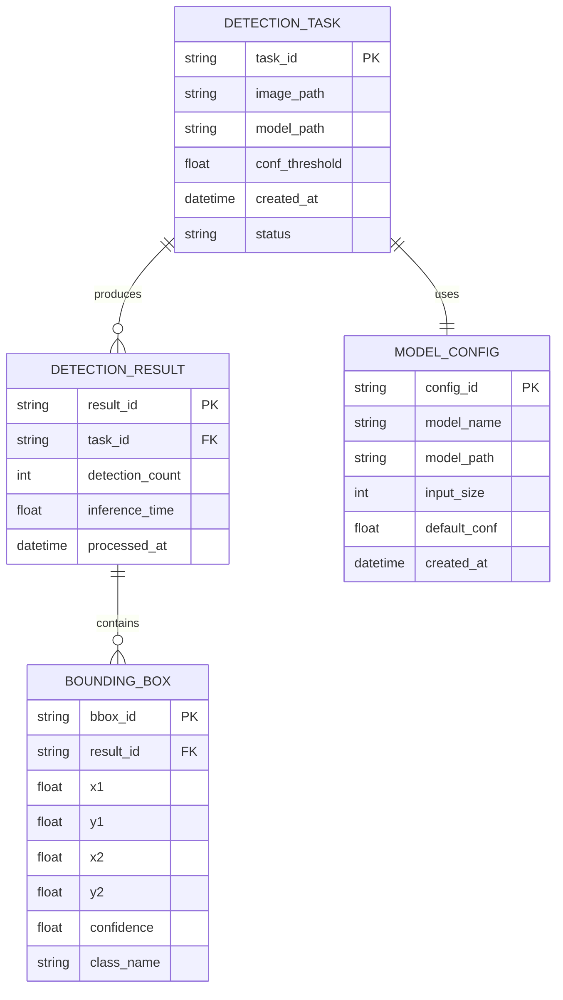

# YOLO26 无人机检测系统技术架构文档

## 1. 架构设计


## 2. 技术描述

- **前端**: Python应用 + Ultralytics YOLO26
- **推理引擎**: YOLO26 CPU优化版本
- **加速库**: OpenVINO (可选)
- **部署**: 本地CPU推理，无需GPU

## 3. 路由定义

| 功能模块 | 用途 |
|----------|------|
| /train | 模型训练接口，支持自定义数据集训练 |
| /predict | 单张图片无人机检测推理 |
| /batch_predict | 批量图片检测处理 |
| /video_detect | 视频流实时无人机检测 |
| /export | 模型导出为不同格式（ONNX, OpenVINO等） |
| /validate | 模型验证和性能评估 |

## 4. API定义

### 4.1 核心API

**模型训练接口**
```python
POST /api/train
```

请求参数:
| 参数名 | 参数类型 | 是否必需 | 描述 |
|--------|----------|----------|------|
| data_path | string | true | 训练数据集路径 |
| epochs | integer | false | 训练轮次，默认100 |
| batch_size | integer | false | 批处理大小，默认16 |
| img_size | integer | false | 输入图像尺寸，默认640 |
| device | string | false | 设备类型，默认'cpu' |

响应:
| 参数名 | 参数类型 | 描述 |
|--------|----------|------|
| status | boolean | 训练状态 |
| model_path | string | 训练完成的模型路径 |
| metrics | object | 训练指标 |

示例:
```json
{
  "data_path": "./drone_dataset",
  "epochs": 100,
  "batch_size": 16,
  "img_size": 640,
  "device": "cpu"
}
```

**推理检测接口**
```python
POST /api/predict
```

请求参数:
| 参数名 | 参数类型 | 是否必需 | 描述 |
|--------|----------|----------|------|
| image | file/string | true | 图像文件或图像路径 |
| model_path | string | false | 模型路径，默认使用最新模型 |
| conf_threshold | float | false | 置信度阈值，默认0.5 |
| device | string | false | 推理设备，默认'cpu' |

响应:
| 参数名 | 参数类型 | 描述 |
|--------|----------|------|
| detections | array | 检测结果数组 |
| inference_time | float | 推理耗时（毫秒） |
| image_size | object | 图像尺寸信息 |

示例:
```json
{
  "detections": [
    {
      "class": "drone",
      "confidence": 0.85,
      "bbox": [100, 150, 200, 250]
    }
  ],
  "inference_time": 45.2,
  "image_size": {"width": 640, "height": 640}
}
```

**批量检测接口**
```python
POST /api/batch_predict
```

请求参数:
| 参数名 | 参数类型 | 是否必需 | 描述 |
|--------|----------|----------|------|
| images | array | true | 图像文件数组或路径数组 |
| model_path | string | false | 模型路径 |
| conf_threshold | float | false | 置信度阈值 |
| batch_size | integer | false | 批处理大小，默认4 |

**视频检测接口**
```python
POST /api/video_detect
```

请求参数:
| 参数名 | 参数类型 | 是否必需 | 描述 |
|--------|----------|----------|------|
| video_path | string | true | 视频文件路径 |
| output_path | string | false | 输出视频路径 |
| model_path | string | false | 模型路径 |
| conf_threshold | float | false | 置信度阈值 |

## 5. 服务架构图


## 6. 数据模型

### 6.1 数据模型定义



### 6.2 数据定义语言

**检测任务表 (detection_tasks)**
```sql
-- 创建检测任务表
CREATE TABLE detection_tasks (
    task_id VARCHAR(36) PRIMARY KEY DEFAULT (UUID()),
    image_path VARCHAR(500) NOT NULL,
    model_path VARCHAR(500) DEFAULT 'yolo26s.pt',
    conf_threshold FLOAT DEFAULT 0.5,
    created_at TIMESTAMP DEFAULT CURRENT_TIMESTAMP,
    status ENUM('pending', 'processing', 'completed', 'failed') DEFAULT 'pending'
);

-- 创建索引
CREATE INDEX idx_detection_tasks_status ON detection_tasks(status);
CREATE INDEX idx_detection_tasks_created_at ON detection_tasks(created_at DESC);
```

**检测结果表 (detection_results)**
```sql
-- 创建检测结果表
CREATE TABLE detection_results (
    result_id VARCHAR(36) PRIMARY KEY DEFAULT (UUID()),
    task_id VARCHAR(36) NOT NULL,
    detection_count INT DEFAULT 0,
    inference_time FLOAT NOT NULL,
    processed_at TIMESTAMP DEFAULT CURRENT_TIMESTAMP,
    FOREIGN KEY (task_id) REFERENCES detection_tasks(task_id)
);

-- 创建索引
CREATE INDEX idx_detection_results_task_id ON detection_results(task_id);
CREATE INDEX idx_detection_results_processed_at ON detection_results(processed_at DESC);
```

**边界框表 (bounding_boxes)**
```sql
-- 创建边界框表
CREATE TABLE bounding_boxes (
    bbox_id VARCHAR(36) PRIMARY KEY DEFAULT (UUID()),
    result_id VARCHAR(36) NOT NULL,
    x1 FLOAT NOT NULL,
    y1 FLOAT NOT NULL,
    x2 FLOAT NOT NULL,
    y2 FLOAT NOT NULL,
    confidence FLOAT NOT NULL,
    class_name VARCHAR(50) DEFAULT 'drone',
    FOREIGN KEY (result_id) REFERENCES detection_results(result_id)
);

-- 创建索引
CREATE INDEX idx_bounding_boxes_result_id ON bounding_boxes(result_id);
CREATE INDEX idx_bounding_boxes_confidence ON bounding_boxes(confidence DESC);
```

**模型配置表 (model_configs)**
```sql
-- 创建模型配置表
CREATE TABLE model_configs (
    config_id VARCHAR(36) PRIMARY KEY DEFAULT (UUID()),
    model_name VARCHAR(100) NOT NULL,
    model_path VARCHAR(500) NOT NULL,
    input_size INT DEFAULT 640,
    default_conf FLOAT DEFAULT 0.5,
    created_at TIMESTAMP DEFAULT CURRENT_TIMESTAMP
);

-- 初始化数据
INSERT INTO model_configs (model_name, model_path, input_size, default_conf) VALUES
('YOLO26n', 'yolo26n.pt', 640, 0.5),
('YOLO26s', 'yolo26s.pt', 640, 0.5),
('YOLO26m', 'yolo26m.pt', 640, 0.5),
('YOLO26l', 'yolo26l.pt', 640, 0.5),
('YOLO26x', 'yolo26x.pt', 640, 0.5);
```

## 7. 性能优化配置

### 7.1 CPU推理优化
```python
# CPU线程配置
import torch
torch.set_num_threads(4)  # 根据CPU核心数调整

# 内存优化
torch.backends.cudnn.benchmark = False
torch.backends.cudnn.deterministic = True
```

### 7.2 批处理优化
```python
# 动态批处理大小
def get_optimal_batch_size(image_count, available_memory):
    if image_count <= 4:
        return image_count
    elif available_memory > 8:  # 8GB+
        return min(8, image_count)
    else:
        return min(4, image_count)
```

### 7.3 OpenVINO集成
```python
# OpenVINO优化配置
from ultralytics import YOLO

# 导出OpenVINO格式
model = YOLO('yolo26s.pt')
model.export(format='openvino', dynamic=False, half=False)

# 使用OpenVINO推理
openvino_model = YOLO('yolo26s_openvino_model')
```

## 8. 部署配置

### 8.1 Docker配置
```dockerfile
FROM python:3.9-slim

# 安装系统依赖
RUN apt-get update && apt-get install -y \
    libglib2.0-0 \
    libsm6 \
    libxext6 \
    libxrender-dev \
    libgomp1 \
    && rm -rf /var/lib/apt/lists/*

# 安装Python依赖
COPY requirements.txt .
RUN pip install --no-cache-dir -r requirements.txt

# 复制应用代码
COPY . /app
WORKDIR /app

# 设置环境变量
ENV OMP_NUM_THREADS=4
ENV MKL_NUM_THREADS=4

EXPOSE 8000
CMD ["python", "app.py"]
```

### 8.2 系统要求
- **CPU**: 4核心以上，支持AVX2指令集
- **内存**: 8GB以上推荐
- **存储**: 2GB可用空间
- **操作系统**: Windows 10+, Ubuntu 18.04+, macOS 10.15+

## 9. 监控和日志

### 9.1 性能监控
```python
import time
import psutil

def monitor_inference(func):
    def wrapper(*args, **kwargs):
        start_time = time.time()
        start_memory = psutil.virtual_memory().used
        
        result = func(*args, **kwargs)
        
        end_time = time.time()
        end_memory = psutil.virtual_memory().used
        
        print(f"推理耗时: {(end_time - start_time)*1000:.2f}ms")
        print(f"内存使用: {(end_memory - start_memory)/1024/1024:.2f}MB")
        
        return result
    return wrapper
```

### 9.2 日志配置
```python
import logging

logging.basicConfig(
    level=logging.INFO,
    format='%(asctime)s - %(name)s - %(levelname)s - %(message)s',
    handlers=[
        logging.FileHandler('yolo26_detection.log'),
        logging.StreamHandler()
    ]
)
```